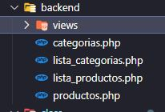

## Material de apoyo a la charla que se realizo en discord :-).

<p style="width:600px; height:300px; display: block; margin: 0 auto;">
  
</p>

## #Dentro de MIPROYECTO creamos una carpeta llamada database.
* Dentro de la misma crear un archivo database.sql en el cual escribiremos la estructura que tendrá la base de datos. para luego ejecutarlo en el gestor MYSQL.
_de esta manera mantenemos un registro de como creamos la base de datos, las tablas y las relaciones_

  

## #Estructura de la carpeta class
* _aca debemos tener la misma cantidad de archivos_
  
   

## #Comenzamos con las Clase Database.
* Primeramente vamos a definir la clase.
>_Como buena practica utilizaremos mayúsculas en la primera letra del nombre en nuestras clases._
* código

```
<?php /* @autor Alexis Jardin */

 class Database {
 
     private $gbd;
 
     //! DEFINIMOS FUNCIÓN CONSTRUCTORA PARA ESTABLECER CONEXIÓN DB

     function __construct($driver, $database, $host, $user, $pass) {
         $coneccion = $driver . ":dbname=" . $database . ";host=$host";
         $this -> gbd = new PDO($coneccion, $user, $pass);
         if (!$this -> gbd) throw new Exception("No se ha podido realizar la conexión.\n\n
         Revisar:\n\t- Parámetros de acceso;\n\t- Credenciales.");
     }
 }
```

## #Ahora continuamos con la creación de las consultas.
### la primera sera SELECT.

>Esta función PHP constructora crea una conexión a la base de datos utilizando los parámetros proporcionados, como el tipo de controlador, nombre de la base de datos, host, usuario y contraseña. Si la conexión no se establece con éxito, se lanza una excepción con un mensaje de error.


```
    //! DEFINIMOS FUNCIÓN SELECT PARA EXTRAER DATOS DE LA BASE DE DATOS
    
    function select($tabla, array $columns = null, $join = null, $condicion = null, $arr_prepare = null, $order = null, $limit = null) {
        $columnSelection = '*';

        $sql = "SELECT " . $columnSelection . " FROM " . $tabla;

        if ($join != null) $sql .= " INNER JOIN " . $join;
        if ($condicion != null) $sql .= " WHERE " . $condicion;
        if ($order != null) $sql .= " ORDER BY " . $order;
        if ($limit != null) $sql .= " LIMIT " . $limit;
        
        $recurso = $this -> gbd -> prepare($sql);
        $recurso -> execute($arr_prepare);

        if ($recurso) return $recurso -> fetchAll(PDO::FETCH_ASSOC);
        else {
            echo '<pre>';
            print_r($this -> gbd -> errorInfo());
            echo '</pre>';

            throw new Exception('No se ha podido realizar la consulta.');
        }
    }
```

### la segunda sera DELETE.

>Esta función en PHP se utiliza para eliminar datos de la base de datos. Toma tres parámetros principales: el nombre de la tabla, una condición que especifica qué registros deben eliminarse y un arreglo opcional para ejecutar la consulta de eliminación de manera segura.

```
    //! DEFINIMOS FUNCIÓN DELETE PARA ELIMINAR DATOS DE LA BASE DE DATOS

    function delete($tabla, $condicion = null, $arr_prepare = null) {
        $sql = "DELETE FROM " . $tabla . " WHERE " . $condicion;

        $recurso = $this -> gbd -> prepare($sql);
        $recurso -> execute($arr_prepare);
        
        if ($recurso) return $recurso -> fetchAll(PDO::FETCH_ASSOC);
        else {
            echo '<pre>';
            print_r($this -> gbd -> errorInfo());
            echo '</pre>';

            throw new Exception('Error al remover los datos.');
        }
    }
```
### la tercera sera INSERT.

>Esta función en PHP se utiliza para insertar datos en una tabla de la base de datos. Toma varios parámetros: el nombre de la tabla $tabla, una cadena de campos $campos , una cadena de valores $valores y un arreglo opcional para ejecutar la consulta de inserción de manera segura.

```
    //! DEFINIMOS FUNCIÓN INSERT PARA AGREGAR NUEVOS DATOS A LA BASE DE DATOS

    function insert($tabla, $campos, $valores, $arr_prepare = null) {
        $sql = "INSERT INTO " . $tabla . "(" . $campos . ") VALUES ($valores)";

        $recurso = $this -> gbd -> prepare($sql);
        $recurso -> execute($arr_prepare);

        if ($recurso) {
            $this -> gbd -> lastInsertId();
            return $recurso -> fetchAll(PDO::FETCH_ASSOC);
        }
        else {
            echo '<pre>';
            print_r($this -> gbd -> errorInfo());
            echo '</pre>';

            throw new Exception('Error al insertar los datos.');
        }
    }
```
### la cuarta sera UPDATE.

>Esta función en PHP se utiliza para actualizar datos en una tabla de la base de datos. Toma varios parámetros: el nombre de la tabla $tabla, el campo que se va a actualizar $campo, el nuevo valor $valor, la condición que especifica qué registros se deben actualizar $condicion, y un arreglo opcional para ejecutar la consulta de actualización de manera segura.

```
    //! DEFINIMOS FUNCIÓN UPDATE PARA MODIFICAR DATOS EXISTENTES EN LA BASE DE DATOS

    function update($tabla, $campo, $valor, $condicion, $arr_prepare = null) {
        $sql = "UPDATE " . $tabla . " SET " . $campo . ' = ' . $valor . " WHERE " . $condicion;

        $recurso = $this -> gbd -> prepare($sql);
        $recurso -> execute($arr_prepare);

        if ($recurso) {
            return $recurso -> fetchAll(PDO::FETCH_ASSOC);
        }
        else {
            echo '<pre>';
            print_r($this -> gbd -> errorInfo());
            echo '</pre>';

            throw new Exception('Error al actualizar los datos.');
        }
    }
 }
```

## #Comenzamos con la clase Categorias.

* Primeramente definimos unas constantes
>_Esto nos ayudara a no tener que repetir lo mismo durante las diferentes funciones, también permite que el código quede mas legible._

```
<?php /* @autor Alexis Jardin */

define("DRIVER", 'mysql');
define("DB", 'miproyecto');
define("HOST", '127.0.0.1');
define("USER", 'root');
define("PASS", '');
define("TABLE", 'categorias');
```
### #Arrancamos a Construirla.
>_Recordamos que como buena practica utilizaremos mayúsculas en la primera letra del nombre en nuestras clases._


>esta función se utiliza para crear objetos de la clase Categorias basados en un ID de categoría proporcionado como parámetro opcional. Si la categoría existe en la base de datos, se inicializan las propiedades del objeto con los datos de la categoría correspondiente. Si no se encuentra la categoría, la función retorna false. Esta funcionalidad permite trabajar con los objetos que representan las categorías de la base de datos.
```
class Categorias {

    protected $id;
    public $nombre;
    private $exists = false;
    
    //! DEFINIMOS EL CONSTRUCTOR PARA LA CREACIÓN DE OBJETOS
    function __construct($id = null) {
            $db = new Database(DRIVER, DB, HOST, USER, PASS);
            $respuesta = $db -> select(TABLE, null, null, "id=?", array($id));

            if (isset($respuesta[0]['id'])) {
                $this -> id = $respuesta[0]['id'];
                $this -> nombre = $respuesta[0]['nombre_categoria'];
                $this -> exists = true;
            }
        else return false;
    }
```

### Ahora vamos a crear una función para manejar si vamos a insertar o actualizar un dato.
>Esto nos permite verificar de antemano que vamos a hacer, si vamos a insertar llamamos a la función insertar, si vamos a actualizar llamamos a la función actualizar. esto se logra cuando se verifica si exists es true o false _(true => actualizamos | false => insertamos)_

```
 //! DEFINIMOS LA FUNCIÓN PARA GUARDAR O ACTUALIZAR UNA CATEGORIA EN LA BASE DE DATOS
    public function guardar() {
        if ($this -> exists) return $this -> actualziar_categoria();
        else return $this -> insertar_categoria();
    }
```
### Continuamos construyendo las funciones en este caso "eliminar()"

```
//! DEFINIMOS LA FUNCIÓN PARA BORRAR UNA CATEGORIA EN LA BASE DE DATOS
    public function eliminar() {
        $db = new Database(DRIVER, DB, HOST, USER, PASS);
        return $db -> delete(TABLE, "id = " . $this -> id);
    }
```
### Continuamos construyendo las funciones en este caso "insertar_categoria()"

```
 //! DEFINIMOS LA FUNCIÓN PARA INSERTAR UNA CATEGORIA EN LA BASE DE DATOS
    private function insertar_categoria() {
        $db = new Database(DRIVER, DB, HOST, USER, PASS);
        $respuesta = $db -> insert(TABLE, "nombre_categoria","?", array($this -> nombre));

        if ($respuesta) {
            $this -> id = $respuesta;
            $this -> exists = true;
            return true;
        }
        else return false;
    }
```
### Continuamos construyendo las funciones en este caso "actualizar_categoria()"

```
//! DEFINIMOS LA FUNCIÓN PARA ACTUALIZAR UNA CATEGORIA EN LA BASE DE DATOS
    private function actualziar_categoria() {
        $db = new Database(DRIVER, DB, HOST, USER, PASS);
        return $db -> update(TABLE, "nombre_categoria","?", array($this -> nombre));

    }
```
### Continuamos construyendo las funciones en este caso "seleccionar_categoriaTB()"

```
//! DEFINIMOS LA FUNCIÓN PARA SELECCIONAR LA TABLA CATEGORIAS
    static public function seleccionar_categoriaTB() {
        $db = new Database(DRIVER, DB, HOST, USER, PASS);
        return $db -> select(TABLE);
    }
```

## #Comenzamos con la clase Productos.

* Primeramente definimos unas constantes
>_Esto nos ayudara a no tener que repetir lo mismo durante las diferentes funciones, también permite que el código quede mas legible._

```
<?php /* @autor Alexis Jardin */

define("DRIVER", 'mysql');
define("DB", 'miproyecto');
define("HOST", '127.0.0.1');
define("USER", 'root');
define("PASS", '');
define("TABLE", 'productos');
```
### #Arrancamos a Construirla.
>_Recordamos que como buena practica utilizaremos mayúsculas en la primera letra del nombre en nuestras clases._


>esta función se utiliza para crear objetos de la clase Productos basados en un ID de Productos proporcionado como parámetro opcional. Si el producto existe en la base de datos, se inicializan las propiedades del objeto con los datos del producto correspondiente. Si no se encuentra el producto, la función retorna false. Esta funcionalidad permite trabajar con los objetos que representan los productos de la base de datos.
```
//! DEFINIMOS EL CONSTRUCTOR PARA LA CREACIÓN DE OBJETOS
    function __construct($id = null) {
        $db = new Database(DRIVER, DB, HOST, USER, PASS);
        $respuesta = $db -> select(TABLE, null, null, "id=?", array($id));
    

        if(isset($respuesta[0]['id'])) {
            $this -> id = $respuesta[0]['id'];
            $this -> nombre = $respuesta[0]['nombre_producto'];
            $this -> descripcion = $respuesta[0]['descripcion_producto'];
            $this -> precio = $respuesta[0]['precio_producto'];
            $this -> categoria = $respuesta[0]['categoria_producto'];
            $this -> imagen = $respuesta[0]['imagen_producto'];
            $this -> exists = true;
        }
        else return false;
    }
```

### Ahora vamos a crear una función para manejar si vamos a insertar o actualizar un dato.
>Esto nos permite verificar de antemano que vamos a hacer, si vamos a insertar llamamos a la función insertar, si vamos a actualizar llamamos a la función actualizar. esto se logra cuando se verifica si exists es true o false _(true => actualizamos | false => insertamos)_

```
  //! DEFINIMOS LA FUNCIÓN PARA GUARDAR O ACTUALIZAR UN PRODUCTO EN LA BASE DE DATOS
    public function guardar() {
        if ($this -> exists) return $this -> actualizar_producto();
        else return $this -> insertar_producto();
    }
```
### Continuamos construyendo las funciones en este caso "eliminar()"

```
//! DEFINIMOS LA FUNCIÓN PARA BORRAR UN PRODUCTO EN LA BASE DE DATOS
    public function eliminar() {
        $db = new Database(DRIVER, DB, HOST, USER, PASS);
        return $db -> delete(TABLE, "id = " . $this -> id);
    }
```
### Continuamos construyendo las funciones en este caso "insertar_producto()"

```
 //! DEFINIMOS LA FUNCIÓN PARA INSERTAR UN PRODUCTO EN LA BASE DE DATOS
    private function insertar_producto() {
        $db = new Database(DRIVER, DB, HOST, USER, PASS);
        $respuesta = $db -> insert(TABLE,
        "nombre_producto, descripcion_producto, precio_producto, categoria_producto, imagen_producto","?, ?, ?, ?, ?",array($this -> nombre, $this -> descripcion, $this -> precio, $this -> categoria, $this -> imagen));
        
        if ($respuesta) {
            $this -> id = $respuesta;
            $this -> exists = true;
            return true;
        }
        else return false;
    }
```
### Continuamos construyendo las funciones en este caso "actualizar_producto()"

```
 //! DEFINIMOS LA FUNCIÓN PARA ACTUALIZAR UN PRODUCTO EN LA BASE DE DATOS
    private function actualizar_producto() {
        $db = new Database(DRIVER, DB, HOST, USER, PASS);
        return $db -> update(TABLE,
        "nombre_producto, descripcion_producto, precio_producto, categoria_producto, imagen_producto","?","?","?","?","?",array($this -> nombre, $this -> descripcion, $this -> precio, $this -> categoria, $this -> imagen));
    }
```
### Continuamos construyendo las funciones en este caso "seleccionar_productosTB()"

```
//! DEFINIMOS LA FUNCIÓN PARA SELECCIONAR LA TABLA PRODUCTOS
    static public function product_selectTB() {
        $db = new Database(DRIVER, DB, HOST, USER, PASS);
       return $db -> select("productos");
    }
```

## #Para finalizar con las clases vamos a realizar la ultima la cual pertenece a Autoload
>La clase Autoload tiene la función de cargar automáticamente las clases necesarias en una aplicación PHP. A menudo, en aplicaciones PHP, necesitas utilizar múltiples clases que están definidas en archivos separados. La carga automática de clases se utiliza para incluir dinámicamente los archivos de clases cuando son necesarios, evitando tener que incluir manualmente cada archivo de clase en tu código.

```
<?php /* @autor Alexis Jardin */

//! DEFINIMOS LA CLASE AUTOLOAD 
class Autoload {

    static public function loadClass($class) {
        $classArr = array();
        $from = __DIR__.DIRECTORY_SEPARATOR;

        $classArr['Database'] = $from . "database.php";
        $classArr['Categorias'] = $from . "categorias.php";
        $classArr['Productos'] = $from . "productos.php";

        if (isset($classArr[$class])) {
            if (file_exists($classArr[$class])) include $classArr[$class];
            else throw new Exception("La clase ".$classArr[$class]." es inexistente.");
        }
    }
}

spl_autoload_register('Autoload::loadClass');
```
## #Vamos a los controladores
* La carpeta debería estar asi



### Controlador de Productos

**Nota:**

- Se incluye el archivo `autoload.php` utilizando `include`. Este archivo se encarga de cargar automáticamente las clases necesarias en la aplicación.

- Se verifica si el formulario ha sido enviado y si el campo `action` del formulario es igual a 'guardar'. Esto indica que se está intentando guardar un nuevo producto en la base de datos.

- Si se cumple la condición del punto anterior, se realiza lo siguiente:
    - Se crea una instancia de la clase `Productos`.
    - Se asignan las propiedades de la instancia (nombre, descripcion, precio y categoria) con los valores provenientes del formulario (`$_POST`).
    - Se procesa la imagen del producto si se ha cargado correctamente desde el formulario. Se verifica si el campo `imagen_producto` tiene un estado de carga (`UPLOAD_ERR_OK`) y se mueve la imagen a una ubicación deseada en el servidor, guardando el nombre de la imagen en la propiedad `imagen` de la instancia del producto.
    - Se llama al método `guardar` de la instancia del producto, que probablemente realiza la inserción del nuevo producto en la base de datos.

- Después de guardar el nuevo producto en la base de datos, se redirige al usuario a la página "lista_productos.php" utilizando `header("Location: lista_productos.php")`. La función `exit` se utiliza para finalizar la ejecución del script de PHP.

- Si no se cumple la condición del punto 2 (es decir, no se ha enviado el formulario o la acción no es "guardar"), se verifica si se ha proporcionado el parámetro `add` en la URL. Si es así, se incluye la vista "productos.html" utilizando `include` y el script termina (`die()`). Esto podría ser utilizado para mostrar un formulario para agregar un nuevo producto.

En resumen, este controlador maneja la creación y el almacenamiento de nuevos productos en la base de datos, así como la visualización del formulario para agregar productos. El código se encarga de procesar los datos del formulario, subir imágenes y redirigir al usuario a la lista de productos después de agregar un nuevo producto.

```
<?php

include '../class/autoload.php';

if (isset($_POST['action']) && $_POST['action'] == 'guardar') {
    $nuevoProducto = new Productos();
    $nuevoProducto->nombre = $_POST['nombre_producto'];
    $nuevoProducto->descripcion = $_POST['descripcion_producto'];
    $nuevoProducto->precio = $_POST['precio_producto'];
    $nuevoProducto->categoria = $_POST['categoria_producto'];

    // PROCESAR LA IMAGEN
    if ($_FILES['imagen_producto']['error'] === UPLOAD_ERR_OK) {
        $nombreArchivo = $_FILES['imagen_producto']['name'];
        $rutaTempArchivo = $_FILES['imagen_producto']['tmp_name'];
        $rutaDestino = '../../img/' . $nombreArchivo;

        if (move_uploaded_file($rutaTempArchivo, $rutaDestino)) {
            $nuevoProducto->imagen = $nombreArchivo;
        }
    }

    $nuevoProducto->guardar();

    header("Location: lista_productos.php");
    exit;

} elseif (isset($_GET['add'])) {
    include 'views/productos.html';
    die();
}
```

### Controlador de Categorias

**Nota:**

- Se incluye el archivo `autoload.php` utilizando `include`. Este archivo se encarga de cargar automáticamente las clases necesarias en la aplicación.

- Se verifica si el formulario ha sido enviado y si el campo `action` del formulario es igual a 'guardar'. Esto indica que se está intentando guardar una nueva categoría en la base de datos.

- Si se cumple la condición del punto anterior, se realiza lo siguiente:
    - Se crea una instancia de la clase `Categorias`.
    - Se asigna la propiedad `nombre` de la instancia con el valor proporcionado en `$_POST['nombre_categoria']`.
    - Se llama al método `guardar` de la instancia de la categoría, que probablemente realiza la inserción de la nueva categoría en la base de datos.

- Si no se cumple la condición de guardar (es decir, no se ha enviado el formulario o la acción no es "guardar"), se verifica si se ha proporcionado el parámetro `add` en la URL. Si es así, se incluye la vista "categorias.html" utilizando `include` y el script termina (`die()`). Esto podría ser utilizado para mostrar un formulario para agregar una nueva categoría.

- Finalmente, se redirige al usuario a la página "lista_categorias.php" utilizando `header("Location: lista_categorias.php")`. La función `exit` se utiliza para finalizar la ejecución del script de PHP.

En resumen, este controlador maneja la creación y el almacenamiento de nuevas categorías en la base de datos, así como la visualización del formulario para agregar categorías. El código se encarga de procesar los datos del formulario y redirigir al usuario a la lista de categorías después de agregar una nueva categoría.


```
<?php

include '../class/autoload.php';

if (isset($_POST['action']) && $_POST['action'] == 'guardar') {
    $nuevaCategoria = new Categorias();
    $nuevaCategoria -> nombre = $_POST['nombre_categoria'];
    $nuevaCategoria -> guardar();
}
else if (isset($_GET['add'])) {
    include 'views/categorias.html';
    die();
}

header("Location: lista_categorias.php");
exit;

```

### Lista_categorias
>En este caso es la estructura html que muestra la lista de Categorias que tenemos ingresadas.

```
<?php
include '../class/autoload.php';
$listaCategorias = Categorias::seleccionar_categoriaTB();
?>

<!DOCTYPE html>
<html lang="es">

<head>
    <meta charset="UTF-8" />
    <meta name="viewport" content="width=device-width, initial-scale=1.0" />
    <title>Listado de Categorías</title>
    <link rel="stylesheet" href="../assets/css/estilos.css" />
</head>

<body>
    <header>
        <nav></nav>
    </header>
    <main>
        <h1 class="subt" >Listado de Categorías</h1>
        <div class="tabla">
            <table>
                <thead>
                    <tr>
                        <th>ID</th>
                        <th>Nombre</th>
                    </tr>
                </thead>
                <tbody>
                    <?php 
                    foreach ($listaCategorias as $categoria) { ?>
                    <tr>
                        <td>
                            <?php echo $categoria['id'] ?>
                        </td>
                        <td>
                            <?php echo $categoria['nombre_categoria'] ?>
                        </td>
                    </tr>
                    <?php } ?>
                </tbody>
            </table>
        </div>

        <a href="views/categorias.html?agregar">Agregar Categoría</a>
    </main>
    <footer>
        <span class="author">Alexis Jardin</span>
    </footer>
</body>

</html>
```
### Lista_productos
>En este caso es la estructura html que muestra la lista de Productos que tenemos ingresados.


```
<?php 
include '../class/autoload.php';
$listaProductos = Productos::seleccionar_productosTB();
?>
<!DOCTYPE html>
<html lang="es">

<head>
    <meta charset="UTF-8" />
    <meta name="viewport" content="width=device-width, initial-scale=1.0" />
    <title>Listado de Productos</title>
    <link rel="stylesheet" href="../assets/css/estilos.css" />
</head>

<body>
    <main>
        <h1 class= "subt">Listado de Productos</h1>
        <div class="tabla-container">
            <table class= "tabla">
                <thead>
                    <tr>
                        <th>ID</th>
                        <th>Nombre</th>
                        <th>Descripción</th>
                        <th>Precio</th>
                        <th>Imagen</th>
                        <th>Categoría</th>
                    </tr>
                </thead>
                <tbody>
                    <?php
                    $rutaCarpetaImagenes = '../assets/img/'; // Ruta de la carpeta de imágenes
                    foreach ($listaProductos as $producto) {
                        $nombreImagen = $producto['imagen_producto']; // Nombre de la imagen desde la base de datos
                        $rutaCompletaImagen = $rutaCarpetaImagenes . $nombreImagen; // Ruta completa de la imagen

                        echo '<tr>';
                        echo '<td>' . $producto['id'] . '</td>';
                        echo '<td>' . $producto['nombre_producto'] . '</td>';
                        echo '<td>' . $producto['descripcion_producto'] . '</td>';
                        echo '<td>' . $producto['precio_producto'] . '</td>';
                        echo '<td></td>';
                        echo '<td>' . $producto['categoria_producto'] . '</td>';
                        echo '</tr>';
                    }
                    ?>
                </tbody>
            </table>
        </div>

        <a href="views/productos.html?agregar">Agregar Producto</a>
    </main>
    <footer>
        <span class="author">Alexis Jardin</span>
    </footer>
</body>

</html>

```
---
### Contacto 🌍

[][website]  -Web
<br/>

[][linkedin] -Linkedin
<br/>

[][instagram] -Instagram
<br/>

[][gitHub] -GitHub
<br/>


[website]: https://alexis-jardin.netlify.app
[linkedin]: https://www.linkedin.com/in/alexis-jardin-a684981b2
[instagram]: https://www.instagram.com/alexis.jardin27
[gitHub]: https://github.com/alexisjardin-js
